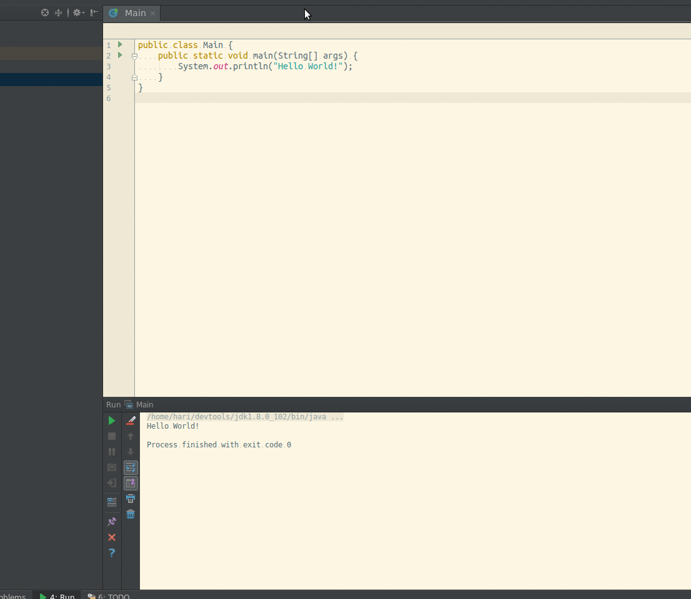

IdeaExActionBar
=================
Prototype plugin put together to demo the possibility of an auto-complete based action list that can be integrated to the IdeaVim plugin. The code has been hacked out from he IdeaVim plugin for the UI components and auto-complete examples from the Intellij community code.

Code definitely needs work. I'm hoping this will trigger interest in making a better Vim command-line interface for IntelliJ.

Default short cut key: Shift-F5

[]

